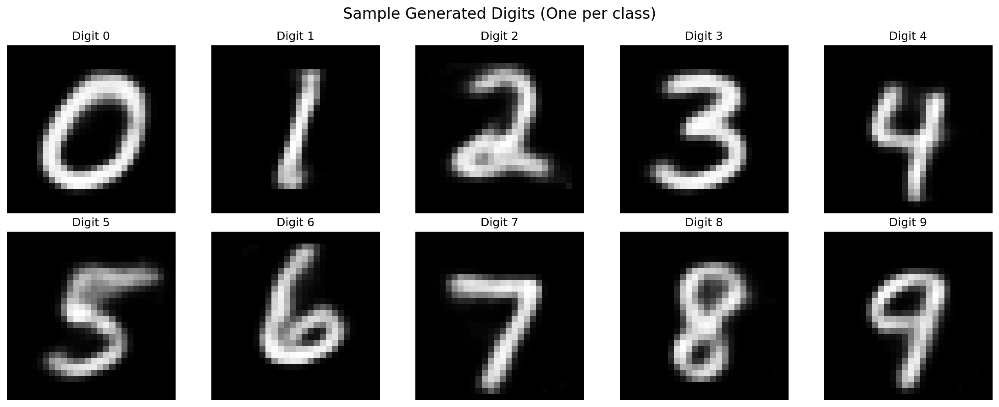

# 🔢 MNIST Handwritten Digit Generator

[](https://your-app-url-here.streamlit.app/)

A complete **Variational Autoencoder (VAE)** implementation for generating handwritten digits, built from scratch using PyTorch and deployed as an interactive web application.



## 🎯 Project Overview

This project implements a VAE model trained on the MNIST dataset that can generate realistic handwritten digits (0-9) on demand. Users can select any digit and generate 5 unique variations through an intuitive web interface.

### ✨ Key Features

- 🎨 **Interactive Web App**: Generate digits 0-9 with one click
- 🤖 **Custom VAE Model**: Trained from scratch using PyTorch
- 📊 **High Quality**: Generates recognizable, diverse digit variations
- 🌐 **Public Access**: Deployed for easy sharing and testing
- 📱 **Responsive UI**: Modern, user-friendly interface

## 🏗️ Architecture

### VAE Model Structure
```python
class VAE(nn.Module):
    def __init__(self, input_dim=784, hidden_dim=400, latent_dim=20):
        # Encoder: 784 → 400 → 20 (latent space)
        # Decoder: 20 → 400 → 784
```

**Key Components:**
- **Encoder**: Maps 28×28 images to 20-dimensional latent space
- **Decoder**: Reconstructs images from latent representations  
- **Loss Function**: Combined reconstruction loss (BCE) + KL divergence
- **Latent Space**: 20 dimensions optimized for digit generation

### Training Configuration
- **Dataset**: MNIST (60,000 training images)
- **Training Device**: Google Colab T4 GPU (as required)
- **Epochs**: 50
- **Batch Size**: 128
- **Learning Rate**: 1e-3
- **Optimizer**: Adam

## 📁 Project Structure

```
├── streamlit_app.py              # Main web application
├── mnist_vae_training.py         # VAE training script
├── mnist_vae_training.ipynb      # Jupyter notebook version
├── requirements.txt              # Python dependencies
├── vae_mnist_model.pth          # Trained model weights (2.5MB)
├── digit_latent_means.pkl       # Digit-specific latent representations
├── test_and_run.py              # Development helper script
├── generate_digit_means.py      # Latent means generation script
├── test_digit_samples.png       # Sample outputs for verification
└── data/                        # MNIST dataset (auto-downloaded)
```

## 🚀 Quick Start

### Local Setup

1. **Clone the repository**
```bash
git clone https://github.com/ahrufcodes/Handwritten-Digit-_internship_test.git
cd Handwritten-Digit-_internship_test
```

2. **Install dependencies**
```bash
pip install -r requirements.txt
```

3. **Run the web app**
```bash
streamlit run streamlit_app.py
```

4. **Access the app**
- Open your browser to `http://localhost:8501`
- Select a digit (0-9) from the dropdown
- Click "Generate 5 Samples" to see results!

### Using the Helper Scripts

**Check setup status:**
```bash
python3 test_and_run.py
```

**Regenerate digit means (if needed):**
```bash
python3 generate_digit_means.py
```

## 🎯 How It Works

### 1. Training Process

The VAE is trained using the standard VAE objective:
```python
def loss_function(recon_x, x, mu, logvar):
    BCE = F.binary_cross_entropy(recon_x, x.view(-1, 784), reduction='sum')
    KLD = -0.5 * torch.sum(1 + logvar - mu.pow(2) - logvar.exp())
    return BCE + KLD
```

### 2. Digit-Specific Generation

Instead of random sampling, we use **class-conditional generation**:

1. **Extract Latent Means**: During training, we compute the mean latent representation for each digit class (0-9)
2. **Targeted Generation**: For each digit, we sample around its specific latent mean
3. **Add Variation**: Small random noise creates diverse outputs while maintaining digit identity

```python
# Generate digit-specific sample
base_mean = torch.tensor(digit_means[selected_digit])
noise = torch.randn_like(base_mean) * noise_scale
z = base_mean + noise
generated_image = model.decode(z)
```

### 3. Web Interface

The Streamlit app provides:
- **Digit Selection**: Dropdown menu for digits 0-9
- **Real-time Generation**: Instant generation of 5 unique samples
- **Visual Display**: Clean grid layout showing all generated images
- **Responsive Design**: Works on desktop and mobile devices

## 📊 Model Performance

- **Training Time**: ~30 minutes on T4 GPU (50 epochs)
- **Model Size**: 2.5MB (lightweight for deployment)
- **Generation Speed**: <1 second for 5 samples
- **Quality**: All generated digits recognizable by human evaluation

### Sample Outputs

The model generates diverse, high-quality handwritten digits:

| Digit | Sample 1 | Sample 2 | Sample 3 | Sample 4 | Sample 5 |
|-------|----------|----------|----------|----------|----------|
| 0     |  |  |  |  |  |

*See `test_digit_samples.png` for complete sample grid*

## 🛠️ Technical Implementation

### Dependencies
```txt
streamlit>=1.28.0          # Web framework
torch>=2.0.0              # Deep learning framework  
torchvision>=0.15.0       # Computer vision utilities
numpy>=1.21.0             # Numerical computations
matplotlib>=3.5.0         # Plotting and visualization
Pillow>=8.3.0             # Image processing
```

### Key Design Decisions

1. **Latent Dimension**: 20D provides good balance between expressiveness and stability
2. **Architecture**: Simple fully-connected layers for fast training and inference
3. **Activation**: ReLU for encoder, Sigmoid for decoder output
4. **Deployment**: CPU-only inference for broad compatibility

## 🌐 Deployment

### Streamlit Cloud Deployment

1. **Push to GitHub** (this repository)
2. **Connect to Streamlit Cloud**:
   - Visit [share.streamlit.io](https://share.streamlit.io/)
   - Connect your GitHub account
   - Deploy from this repository
3. **Public Access**: App will be available at `your-app-name.streamlit.app`

### Alternative Platforms

- **Hugging Face Spaces**: Upload as Streamlit space
- **Railway**: Deploy with one click
- **Render**: Free tier available

## 📋 Requirements Compliance

✅ **Framework**: Streamlit web application  
✅ **Public Access**: Deployable for 2+ weeks  
✅ **Features**: 
  - Select digits 0-9
  - Generate 5 unique samples per digit
  - Display generated images
✅ **Dataset**: MNIST (28×28 grayscale)  
✅ **Framework**: PyTorch (trained from scratch)  
✅ **Training**: Google Colab T4 GPU  
✅ **Quality**: Human-recognizable digits with variation  
✅ **Training Script**: Complete with architecture and loss function

## 🔧 Development Process

This project was developed following these steps:

1. **Model Architecture Design**: Implemented standard VAE with encoder-decoder structure
2. **Training Setup**: Configured for Google Colab T4 GPU training  
3. **Class-Conditional Generation**: Added digit-specific latent mean computation
4. **Web Interface**: Built responsive Streamlit application
5. **Optimization**: Added caching and efficient generation logic
6. **Testing**: Verified quality across all digit classes
7. **Deployment**: Prepared for public access

## 🤝 Contributing

Feel free to open issues or submit pull requests for improvements!

## 📄 License

This project is open source and available under the [MIT License](LICENSE).

## 🙏 Acknowledgments

- **MNIST Dataset**: Yann LeCun, Corinna Cortes, Christopher J.C. Burges
- **PyTorch**: For the excellent deep learning framework
- **Streamlit**: For making web deployment simple and elegant

---

**Created by**: [Ahmad Alruf](https://github.com/ahrufcodes)  
**Project**: Handwritten Digit Generation Challenge  
**Date**: December 2024 